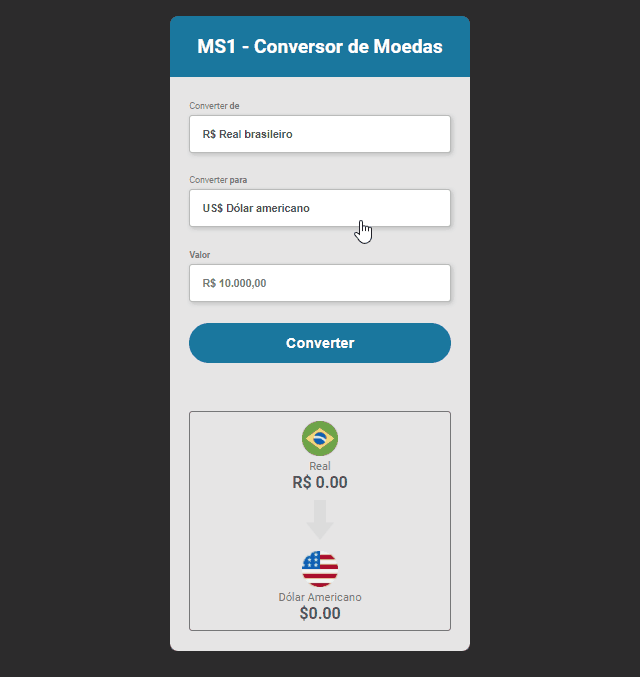

# Conversor de moedas

## Índice

- [Visão geral](#visão-geral)
  - [Captura de tela](#screenshot)
  - [Links](#links)
- [Meu processo](#meu-processo)
  - [Construído com](#construído-com)
  - [O que aprendi](#o-que-eu-aprendi)
- [Autor](#autor)

## Visão geral

### Screenshot

### Links

- Código: (https://github.com/eduardonobrega/conversor-de-moedas)
- Site ao vivo: (https://eduardonobrega.github.io/conversor-de-moedas/)

## Meu processo

### Construído com
- Marcação HTML5 semântica
- Propriedades personalizadas de CSS
- JavaScript
- API (https://docs.awesomeapi.com.br/api-de-moedas)

### O que eu aprendi

Aprendi a fazer consumo de uma API  que fornece a contação Atual do Dolar e do Euro.

## Autor

- Github - [@eduardonobrega](https://github.com/eduardonobrega)

